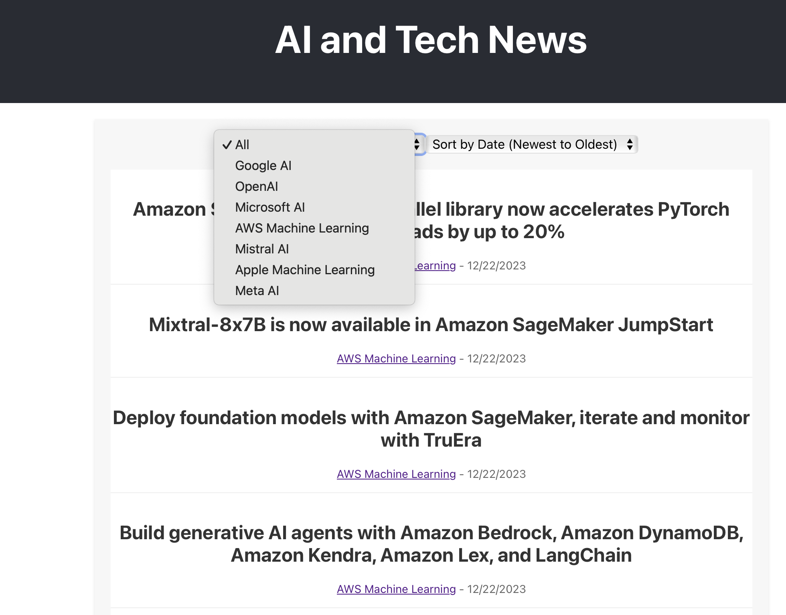
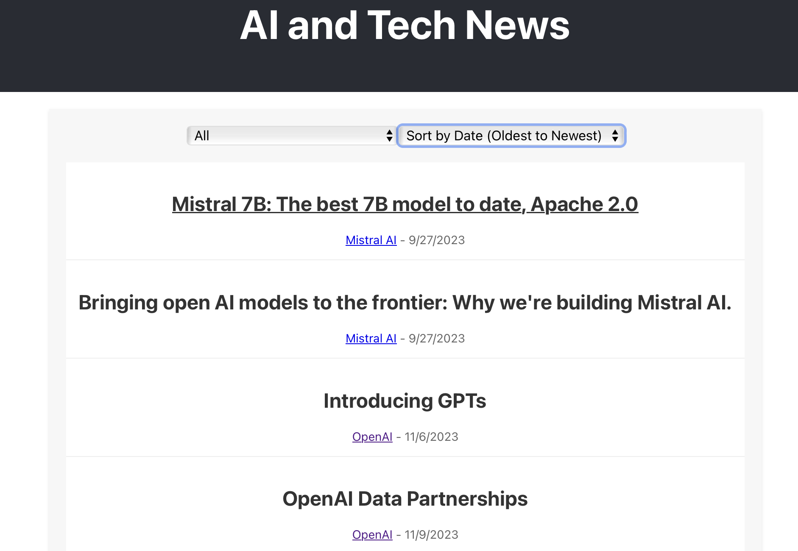

# Distributed Web Crawler Pipeline

## Overview
I made this Web Crawler to crawl and aggregate AI and tech news articles from seven companies including OpenAI, Meta, Microsoft, Google, Amazon, Apple, and Mistral using Python, Flask, and React, and uses RabbitMQ for message queuing and Elasticsearch for data storage and searching. This project is fully dockerized. Makes it easier to see the newest AI news, but of course could be further scaled for more data and for other purposes. 

## Screenshots

  
   

## Features
- Crawls and collects news articles specified tech companies.
- Uses RabbitMQ for distributed message queuing.
- Stores and indexes articles in Elasticsearch.
- Uses Flask backend API for data access and manipulation.
- Uses React-based frontend for displaying articles with sorting and filtering options.
- Dockerized components for easy setup and scalability.

## Getting Started

### Prerequisites
- Docker
- Docker Compose

### Installation
1. Clone the repository:
git clone https://github.com/heming277/DistributedWebCrawlerPipeline.git

2. Navigate to the project directory:
cd DistributedWebCrawlerPipeline

3. Start using Docker Compose:
docker-compose up --build

### Usage
Once services are running, you can access the following:
- **Frontend Interface**: Open your web browser and navigate to `http://localhost` to see the frontend.
- **Backend API**: Send requests to `http://localhost:5001/articles` to see the articles API.
- **Elasticsearch**: Access the Elasticsearch instance on `http://localhost:9200`.
- **RabbitMQ Management Interface**: Access the RabbitMQ management interface on `http://localhost:15672`.

## License
MIT license 

